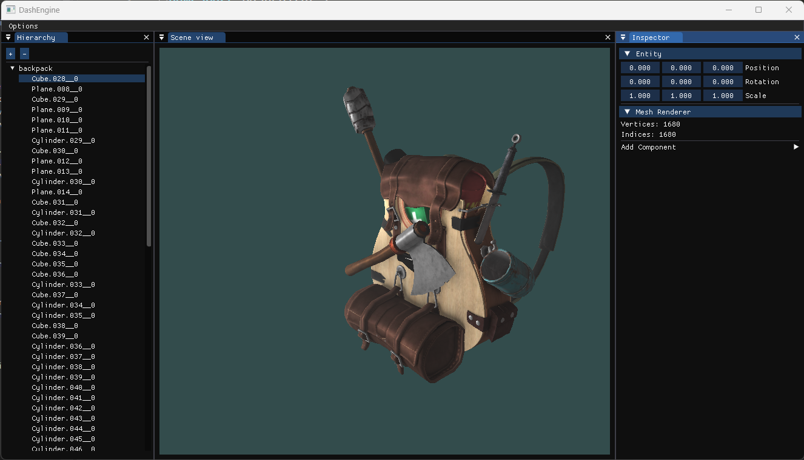

# DashEngine - 3D and 2D Framework in C++

Welcome to DashEngine, a lightweight C++ framework for creating dynamic 3D and 2D applications based on modern Opengl. It provides essential tools to streamline your development process and unleash your creativity.

## Features

- **Cross-Platform:** DashEngine is designed to be cross-platform, supporting major operating systems such as Windows, macOS, and Linux.
- **Modular Architecture:** The framework is built with a modular architecture, allowing you to use only the components you need for your specific project.
- **Graphics Rendering:** DashEngine supports both 3D and 2D rendering, utilizing modern OpenGL.
- **Scene Management:** Easily manage scenes and entities.
- **Input Handling:** Efficiently handle user input with the GLFW input system.
- **Resource Management:** Manage assets with DashEngine's resource management system, supporting various asset types like textures, models, and shaders
# screenshots :


## Dependencies

| Library | Purpose |
| ------- | ------- |
| [GLFW](https://github.com/glfw/glfw) | Window creation and input handling. Provides a simple and cross-platform interface for managing windows, inputs, and events. |
| [GLAD](https://github.com/Dav1dde/glad) | OpenGL loader generator. GLAD is used to load OpenGL functions at runtime, allowing flexibility in OpenGL version and extensions. |
| [GLM](https://github.com/g-truc/glm) | Mathematics library for graphics programming. GLM provides a collection of functions for vector and matrix operations, making mathematical operations in OpenGL applications more convenient. |
| [stb](https://github.com/nothings/stb) | Single-file public domain libraries. DashEngine may use specific stb libraries (e.g., stb_image) for loading image files and other utility functions. |

# Getting Started

## Windows
You will need git and CMake to build and run the project
1. **Clone the DashEngine repository:**
  ```bash
  git clone https://github.com/ZermatAbdenour/DashEngine.git
  ```
2. **Create a Build Directory:**

  ```bash
    cd DashEngine
    mkdir build
    cd build
  ```
3. **Generate Build Files with CMake:**
  ```bash
    cmake ..
  ```
4. **Set Your Game Project as the Startup Project:**

    Open your integrated development environment (IDE).
  - Right-click on the Game project in the IDE.
  - Select "Set as Startup Project" to ensure that when you run the project, the Game executable is launched.
  - Build and Run Your Game Executable:

# License
MIT License

Copyright (c) 2023 Zermat Abdenour

Permission is hereby granted, free of charge, to any person obtaining a copy
of this software and associated documentation files (the "Software"), to deal
in the Software without restriction, including without limitation the rights
to use, copy, modify, merge, publish, distribute, sublicense, and/or sell
copies of the Software, and to permit persons to whom the Software is
furnished to do so, subject to the following conditions:

The above copyright notice and this permission notice shall be included in all
copies or substantial portions of the Software.

THE SOFTWARE IS PROVIDED "AS IS", WITHOUT WARRANTY OF ANY KIND, EXPRESS OR
IMPLIED, INCLUDING BUT NOT LIMITED TO THE WARRANTIES OF MERCHANTABILITY,
FITNESS FOR A PARTICULAR PURPOSE AND NONINFRINGEMENT. IN NO EVENT SHALL THE
AUTHORS OR COPYRIGHT HOLDERS BE LIABLE FOR ANY CLAIM, DAMAGES OR OTHER
LIABILITY, WHETHER IN AN ACTION OF CONTRACT, TORT OR OTHERWISE, ARISING FROM,
OUT OF OR IN CONNECTION WITH THE SOFTWARE OR THE USE OR OTHER DEALINGS IN THE
SOFTWARE.
